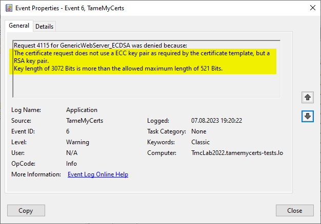

## Configuring rules for the key pair of a CSR {#key-rules}

> Applies to **online** and **offline** certificate templates.

The "Windows Default" policy is only capable to enforce a minimum key length, but not the key algorithm and not the maximum key length to be used. This may lead to issuance of certificates using weak keys, e.g. when submitting a request using a small RSA key to a certificate template that is configured to use an ECC key.



### Configuring

You can specify the following parameters for the private key:

The **MinimumKeyLength** directive specifies the minimum key length the certificate request must use. Defaults to "0" (any key size is allowed). Though the Windows Default policy module also verifies this, this may become handy in a migration scenario where you publish the same template both on the old and new certification authority and plan to increase key size when switching to the new one whilst keeping the productive system unchanged.

The **MaximumKeyLength** directive specifies the maximum key length the certificate request can use. Defaults to "0" (any key size is allowed).

> The key algorithm is automatically determined based on the settings of the used certificate template and is enforced automatically.

### Example

Key size must exactly be 384 bits, assuming the certificate template uses an ECC key and specifies a minimum key size of 384 bits (thus minimum and maximum key size are equal).

```xml
<MaximumKeyLength>384</MaximumKeyLength>
```

Key size must exactly be 384 bits, assuming the certificate template uses an ECC key and specifies a lower key size.

```xml
<MinimumKeyLength>384</MinimumKeyLength>
<MaximumKeyLength>384</MaximumKeyLength>
```

Key size must be between 2048 and 4096 bits, assuming the certificate template uses an RSA key and specifies a lower key size.

```xml
<MinimumKeyLength>2048</MinimumKeyLength>
<MaximumKeyLength>4096</MaximumKeyLength>
```