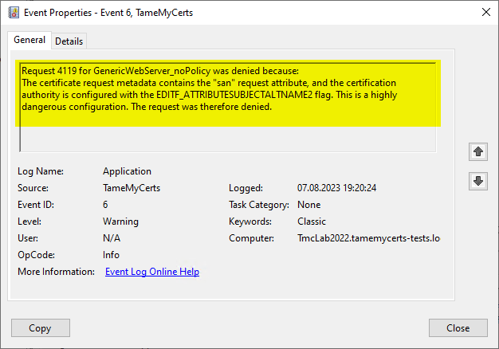

### How TameMyCerts can detect and stop attacks against the ESC6 attack vector {#uc-esc6}

Many HowTos on the web instruct CA administrators to enable the **EDITF\_ATTRIBUTESUBJECTALTNAME2** flag on their CAs. However, this opens a large security hole, as this setting allows anyone to request any identity for any certificate template. These kinds of attack against Microsoft Active Directory Certificate Services have widely become known as "ESC6" (<https://posts.specterops.io/certified-pre-owned-d95910965cd2>) in the security scene.

ESC6 abuses a certification authority that has the EDITF\_ATTRIBUTESUBJECTALTNAME2 flag globally enabled. When this flag is enabled in the certification authoritys configuration - either by lack of knowledge or by accident - an attacker can send a malicious request attribute to the certification authority (<https://www.gradenegger.eu/en/take-over-the-active-directory-overall-structure-with-the-flag-editf_attributesubjectaltname2/>) whilst submitting a legitimate certificate request, instructing the certification authoritry to add the specified content to the Subject Alternative Name (SAN) extension of the issued certificate, regardless of certificate template security settings.

TameMyCerts ensures that such attempts to abuse the certification authority are detected and requests are denied, should the insecure flag be enabled. The denied certificate request [is getting logged](#logs), so that an alert can be triggered.

> This mechanism was adopted as a core part of the _Certiception_ (<https://github.com/srlabs/Certiception>) honeypot toolkit for Active Directory Certificate Services and allows spotting adversaries trying to abuse a certification authority.

> Administrators sometimes enable the setting to be able to add SANs to certificate requests not containing them (e.g. because the host on which the original certificate request was made is not capable of requesting SANs). In the most common use case of Web Server certificates, certificates without a SAN (in form of a DNS Name) will get rejected by applications (any modern web browser like Mozilla Firefox, Google Chrome, Microsoft Edge, and so on). TameMyCerts provides a secure alternative to this approach in that it is able to detect DNS Names and IP addresses found in the Common Name of a certificate request and [automatically transfer them to a newly-built SAN certificate extension](#uc-supplement-dns).